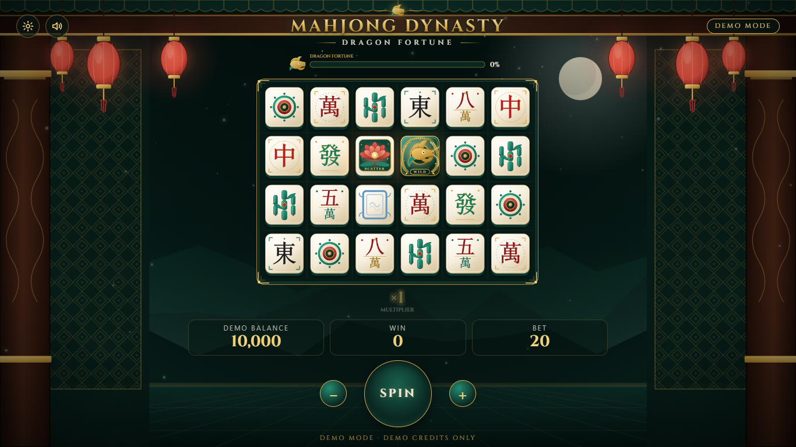
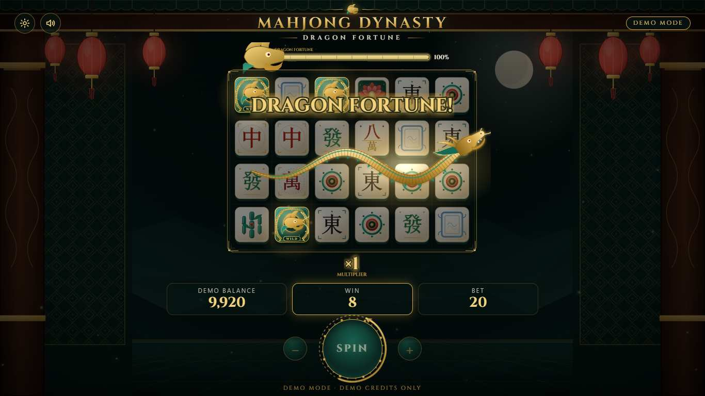
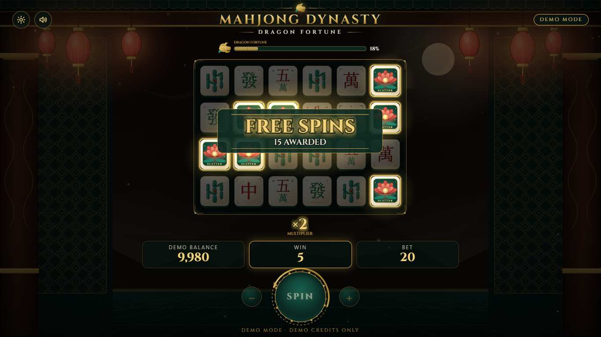

# Mahjong Dynasty: Dragon Fortune

A polished, browser-based, full-stack **Mahjong-inspired cascading slot-style demo game**.
A mystical ancient-Chinese palace at night, a Golden Dragon that controls fortune, and a server
that decides every outcome while the browser (React + Phaser 3) simply brings it to life.

> **DEMO MODE · DEMO CREDITS.**
> This project uses virtual demo credits only and does not implement deposits, withdrawals,
> payment processing, or real-money wagering.

| Game (6 × 4 board)                        |
| ----------------------------------------- |
|  |

| Dragon Fortune (signature moment)                      | Free Spins                                     |
| ------------------------------------------------------ | ---------------------------------------------- |
|  |  |

---

## Table of contents

1. [Project overview](#project-overview)
2. [Features](#features)
3. [Technology stack](#technology-stack)
4. [Architecture](#architecture)
5. [Directory structure](#directory-structure)
6. [Frontend](#frontend) · [Backend](#backend) · [Game engine](#game-engine) · [Database](#database) · [API](#api) · [Security](#security)
7. [Installation (Windows)](#installation-windows)
8. [Docker / PostgreSQL](#docker--postgresql) · [Environment](#environment) · [Database migration](#database-migration)
9. [Running the project](#running-the-project) · [Testing](#testing) · [Simulation](#simulation) · [Building](#building)
10. [Git workflow](#git-workflow) · [Asset guide](#asset-guide) · [Replacing artwork](#replacing-artwork) · [Replacing audio](#replacing-audio)
11. [Known limitations](#known-limitations) · [Future improvements](#future-improvements)

---

## Project overview

- **Website / web game only** – opens in Chrome, Edge, Firefox and Safari. No Electron, no desktop
  or mobile app.
- **Free and open source everywhere** – React, Phaser 3, Express, Prisma, PostgreSQL, Vitest… No paid
  API, database, auth provider, game engine, asset or hosting is required. Everything runs locally.
- **Server-authoritative** – the browser sends only _"bet 50"_ and a request id. The API validates
  the player and balance, generates the board with a secure RNG, evaluates wins and cascades,
  applies multipliers, Dragon Fortune and Free Spins, stores the result and updates the demo balance.
  Phaser then **animates that stored result**; nothing about the outcome is calculated in the browser.
- **Original identity** – all artwork (tiles, backgrounds, logo, dragon) is generated by
  [`scripts/generate-assets.mjs`](scripts/generate-assets.mjs) as original SVG, so the project works
  the moment you install it and can be re-skinned file by file.

## Features

- 6 × 4 board, **ways-to-win** evaluation (3+ adjacent reels from the left), Wild substitution
- **Cascading wins** with the multiplier ladder ×1 → ×2 → ×3 → ×5 → ×8 (Free Spins: ×2 → ×4 → ×6 → ×10)
- **Dragon Fortune** meter → golden dragon sweeps the board and turns 3–6 server-chosen tiles into Wilds
- **Golden Dragon Wild** and **Lotus Scatter** (3 / 4 / 5+ Lotus = 8 / 12 / 15 Free Spins, retriggers supported)
- **Wild Reel Respin** – when a Golden Wild lands on the first board it can lock its whole reel as Wilds while the other reels respin once (chance set in `gameConfig.ts`, decided by the server)
- **Leaderboard** of the biggest single-spin demo wins (all time / last 24 hours, usernames only)
- **Free Spins** stored server-side – refreshing the browser never loses them; the palace transforms into a warm red/gold atmosphere
- BIG / MEGA / EPIC WIN presentation with count-up (only for large wins)
- **No sign-up and no log-in**: the site opens straight into the game and the server gives each browser an anonymous **guest player** (like `Guest4821`, 10,000 demo credits) remembered in an **HttpOnly** cookie. Balance, Free Spins and history stay on the server
- Profile with lifetime stats and recent spins; spin history endpoint
- Idempotent, transaction-safe spins (double clicks and concurrent requests cannot double-charge)
- **Auto spin**: one button starts and stops it (choose 10 / 25 / 50 / 100 / until stopped); it also stops by itself on an error or when the balance can't cover the bet
- **Turbo** (faster animations; pressing the Space bar while a spin plays fast-forwards it), auto spin counts of 10 / 25 / 50 / 100 / until stopped, and separate **Music** and **Effects** volume sliders
- **Paytable** in the game (gear-menu or table button) and on the About page, showing the credits paid per way at the bet you pick
- **English / Chinese (中文)** language switch on every page; the choice is remembered (translations live in `apps/web/src/i18n/translations.ts`)
- Audio: 12 original generated placeholder sounds (effects + two music loops), separate Music / Effects volume; the game is fully playable if any file is missing
- Responsive: 1920×1080, 1366×768, tablet, mobile portrait and landscape
- RTP / hit-frequency **simulator** (`npm run simulate`)
- 150+ automated tests (engine unit tests, API integration tests against PostgreSQL, React tests)

## Technology stack

| Area      | Technology                                                                                          |
| --------- | --------------------------------------------------------------------------------------------------- |
| Monorepo  | npm workspaces                                                                                      |
| Frontend  | React 19, TypeScript, Vite 7, **Phaser 3**, React Router, TanStack Query, Zustand, Zod, CSS Modules |
| Backend   | Node.js, TypeScript, Express 5, Prisma 6, PostgreSQL, Zod, JWT, Helmet, CORS, express-rate-limit    |
| Testing   | Vitest, React Testing Library, Supertest                                                            |
| Dev / Ops | Docker (Dockerfile + Compose), Playwright, ESLint 9, Prettier, GitHub Actions                       |
| Fonts     | Cinzel (SIL OFL, bundled via `@fontsource`, not a paid font)                                        |

## Architecture

```
┌──────────────────────── Browser ────────────────────────┐          ┌──────────── API (Express) ────────────┐
│ React pages / HUD (bet, SPIN, balance)                  │  POST    │ auth · validation (Zod) · rate limit  │
│   │  request: { bet, requestId }                        │ ───────► │ GameService (DB transaction + row lock)│
│   ▼                                                     │ /api/    │   └─ GameEngine (pure, no HTTP/UI)    │
│ GameController ──► Phaser scenes (Boot/Preload/Game)    │ game/    │        BoardGenerator · WinEvaluator  │
│   ▲   animates the SERVER result only                   │ spin     │        CascadeEngine · MultiplierEngine│
│   └── full result: boards, cascades, multipliers,       │ ◄─────── │        DragonFortuneEngine · FreeSpin │
│       Dragon Fortune, Free Spins, new balance           │          │        RandomSource (crypto)          │
└─────────────────────────────────────────────────────────┘          └──────────────┬────────────────────────┘
                     packages/shared: types · Zod schemas · constants                │ Prisma
                                                                              PostgreSQL (User, GameSession, Spin)
```

Key rules: the API is the single source of truth; `packages/shared` holds every type and schema used
by both sides (no duplicated types); game logic lives only in `apps/api/src/game` (no game maths in
React or Phaser).

## Directory structure

```
mahjong-dynasty/
├── apps/
│   ├── web/                       React + Phaser client
│   │   ├── public/assets/         symbols/ backgrounds/ ui/ effects/ audio/  (+ README.md)
│   │   └── src/
│   │       ├── api/               fetch client + typed endpoints
│   │       ├── components/        HUD, BetControls, SpinButton, PalaceBackground, Logo, overlays …
│   │       ├── game/              GameController (React↔Phaser bridge), config, assets
│   │       │   ├── scenes/        BootScene, PreloadScene, GameScene
│   │       │   ├── objects/       MahjongTile, GameBoard, DragonMeter, MultiplierDisplay, FloatingWinText
│   │       │   ├── effects/       WinEffect, DragonEffect, ScatterEffect
│   │       │   ├── animations/    tween helpers
│   │       │   └── audio/         AudioManager (safe when files are missing)
│   │       ├── hooks/ layouts/ pages/ store/ styles/ types/ utils/ test/
│   │       ├── App.tsx  main.tsx
│   └── api/                       authoritative game server
│       ├── prisma/                schema.prisma, migrations/
│       ├── src/
│       │   ├── game/              GameEngine, BoardGenerator, WinEvaluator, CascadeEngine,
│       │   │                      MultiplierEngine, DragonFortuneEngine, FreeSpinEngine,
│       │   │                      RandomSource, simulation.ts, config/gameConfig.ts
│       │   ├── controllers/ routes/ services/ middleware/ config/ utils/
│       │   ├── app.ts  server.ts  simulate.ts
│       └── tests/                 game/ (unit) · integration/ (supertest + PostgreSQL)
├── packages/shared/src/           types/ schemas/ constants/
├── scripts/                       generate-assets.mjs, embedded-postgres.mjs
├── docs/screenshots/
├── docker-compose.yml  .env.example  eslint.config.js  .github/workflows/ci.yml  package.json
```

## Frontend

- **Pages:** `/` the game · `/profile` · `/leaderboard` · `/about` (rules + paytable). Visitors are given a guest player automatically; the old `/game` address redirects to `/`.
- The game page is lazy-loaded so Phaser (≈1.2 MB, split into its own chunk) is only downloaded when
  a player enters the game.
- **React** owns the chrome (background, logo, HUD, overlays, settings); **Phaser** owns the board,
  tiles, meter, multiplier, particles and the Dragon. `GameController` is the only bridge:
  `create()`, `playSpin(result, hooks)`, `showBoard()`, `setMeter()`, `setMode()`, `destroy()`.
- The canvas is scaled with `Phaser.Scale.FIT` into the space left between the header and HUD, so the
  game dominates the screen (no big website navigation bar above it).
- Palace background = two SVGs cross-faded (normal / Free Spins) + CSS gold particles.
- If an image fails to load, `PreloadScene` generates a simple fallback so the game never breaks.

## Backend

Layered Express app: `routes → middleware (auth, Zod validation, rate limit) → controllers →
services → Prisma`. `createApp({ prisma, env, rng })` is dependency-injected, which is how the
integration tests use a seeded RNG. All errors flow through one central handler that never leaks
stack traces. `GET /api/health` is the liveness probe.

## Game engine

All logic lives in [`apps/api/src/game`](apps/api/src/game) and is independent of Express, React and Phaser.

| Module                | Responsibility                                                                                                                                                                                                 |
| --------------------- | -------------------------------------------------------------------------------------------------------------------------------------------------------------------------------------------------------------- |
| `RandomSource`        | `interface RandomSource { next(): number }`. `CryptoRandomSource` (Node `crypto`) is the default; `SeededRandomSource` is for tests / simulation / debugging only. `Math.random()` is never used for outcomes. |
| `BoardGenerator`      | Weighted symbols per reel (config), separate weights for Free Spins; Wilds only on the four middle reels.                                                                                                      |
| `WinEvaluator`        | Ways-to-win from the left; Wild substitutes for every regular symbol, never for the Lotus. Line payouts are unrounded; each cascade is rounded once so return does not depend on bet size.                     |
| `CascadeEngine`       | Removes winning tiles, applies gravity, generates replacements and returns the exact `moves` / `spawns` for animation.                                                                                         |
| `MultiplierEngine`    | Base ladder ×1, ×2, ×3, ×5, ×8 (×8 from cascade 5); Free Spins ×2, ×4, ×6, ×10.                                                                                                                                |
| `DragonFortuneEngine` | Each winning cascade fills the meter (+8 / +10 / +12 / +15). At 100% it selects 3–6 regular tiles and turns them into Wilds, then resets the meter.                                                            |
| `FreeSpinEngine`      | Lotus awards (3 → 8, 4 → 12, 5+ → 15), retrigger awards, and the persisted Free Spin round (locked bet, running win, completion).                                                                              |
| `GameEngine`          | Orchestrates one spin and returns the complete `SpinOutcome`.                                                                                                                                                  |

**Everything is configurable** in [`config/gameConfig.ts`](apps/api/src/game/config/gameConfig.ts):
weights, paytable, multiplier ladders, Free Spin awards, Dragon gains, big-win thresholds, max win
(5,000 × bet) and the cascade safety cap.

**Demo maths, tuned with the simulator** (`--spins=300000`): observed return ≈ 94–100 % depending on
bet size, hit frequency ≈ 45 %, Free Spins ≈ 1 in 75 paid spins, Dragon Fortune ≈ 1 in 14 spins,
largest win in the hundreds of × bet.
**FOR DEVELOPMENT / DEMONSTRATION ONLY – NOT CERTIFIED GAME MATH.**

## Database

PostgreSQL + Prisma ([`schema.prisma`](apps/api/prisma/schema.prisma)):

- `User` – id, username (unique, like `Guest4821`), `demoBalance` (default 10,000), timestamps. No email or password: players are anonymous guests
- `GameSession` – one per user: `dragonMeter`, `freeSpinsRemaining`, `freeSpinsTotal`, `freeSpinBet`, `freeSpinsWin`
- `Spin` – userId, sessionId, `requestId` (idempotency key, unique per user), bet, `isFreeSpin`, totalWin,
  balanceBefore/After, freeSpinsAwarded, dragonFortuneTriggers, cascadeCount, `resultJson` (the full outcome), createdAt

Indexes: unique `(userId, requestId)`, `(userId, createdAt desc)`, `(sessionId)`. Money is stored as integers.

## API

| Method & path                     | Auth | Description                                                                                                         |
| --------------------------------- | :--: | ------------------------------------------------------------------------------------------------------------------- |
| `POST /api/auth/guest`            |  –   | Returns this browser's guest player, creating one (10,000 demo credits) on the first visit; sets an HttpOnly cookie |
| `GET  /api/auth/me`               |  ✔   | Current guest player                                                                                                |
| `GET  /api/game/config`           |  –   | Public game config (bets, multipliers, awards, paytable)                                                            |
| `GET  /api/game/state`            |  ✔   | Balance, Dragon meter, Free Spins, last board                                                                       |
| `POST /api/game/spin`             |  ✔   | `{ bet, requestId }` → complete spin result                                                                         |
| `GET  /api/game/history?limit=20` |  ✔   | Recent spins                                                                                                        |
| `GET  /api/profile`               |  ✔   | Profile, lifetime stats, recent spins                                                                               |
| `GET  /api/leaderboard`           |  ✔   | Top single-spin wins (`period=all\|day`, `limit`), usernames only                                                   |
| `GET  /api/health`                |  –   | Health check                                                                                                        |

Errors are always `{ "error": { "code", "message", "details?" } }`.

## Security

- **No passwords and no personal data**: players are anonymous guests, identified by a signed **JWT in an HttpOnly, SameSite=Lax cookie** (Secure in production; kept for a year and renewed on each visit). Creating a NEW guest is rate limited per address; coming back to the site is not
- No tokens in JavaScript / localStorage
- **Helmet**, **CORS** limited to `WEB_ORIGIN`, **rate limiting** (global / auth / spin), 10 kB body limit
- **Zod** validation on every input; unknown fields are stripped – the client can never supply
  balance, win, board, multiplier, Free Spins or Dragon meter
- Origin check on state-changing requests (CSRF defence in depth)
- **Transactions + `SELECT … FOR UPDATE`** row lock per user, an in-process spin lock (`409 SPIN_IN_PROGRESS`)
  and a unique `(userId, requestId)` key for idempotent retries → no double charge, ever
- Central error handler; secrets only from environment variables; `.env` is git-ignored

---

## Installation (Windows)

**Requirements:** [Node.js 20.19+ or 22](https://nodejs.org) (LTS), Git, and _either_ Docker Desktop
_or_ nothing else (see the Docker-free option below). PostgreSQL is not installed globally.

Open **Windows CMD** (or PowerShell) in VS Code (`` Ctrl+` ``):

```bat
cd C:\Users\user\mahjong-dynasty
npm install
copy .env.example .env
```

Then edit `.env` and replace `JWT_SECRET` with a long random string. Generate one with:

```bat
node -e "console.log(require('crypto').randomBytes(48).toString('hex'))"
```

## Docker / PostgreSQL

**Option A – Docker Desktop (recommended):**

```bat
docker compose up -d
```

This starts `postgres:17-alpine` on `localhost:5432` (user/password `mahjong`, database `mahjong_dynasty`).
Stop with `docker compose down` (add `-v` to erase the data).

**Option B – no Docker:** run a real local PostgreSQL 17 straight from npm (data in `.pgdata/`):

```bat
npm run db:embedded
```

Leave that window open. Do not run A and B at the same time (both use port 5432).

## Environment

`.env.example` → `.env` (never commit `.env`):

| Variable                    | Meaning                                                                |
| --------------------------- | ---------------------------------------------------------------------- |
| `DATABASE_URL`              | PostgreSQL connection string (default matches Docker / embedded setup) |
| `JWT_SECRET`                | Long random secret (≥ 32 chars in production)                          |
| `API_PORT`                  | API port (default `4000`)                                              |
| `WEB_ORIGIN`                | Allowed CORS origin (default `http://localhost:5173`)                  |
| `NODE_ENV`                  | `development` / `test` / `production`                                  |
| `TRUST_PROXY` _(optional)_  | Reverse proxies in front of the API (`1` behind nginx; default `0`)    |
| `VITE_API_URL` _(optional)_ | Absolute API URL for the web build when not using the dev proxy        |

## Database migration

```bat
npm run db:migrate
```

There is **nothing to seed** and no demo account: opening the site makes the server create a guest
player with 10,000 DEMO CREDITS. There is intentionally no top-up feature (this is not a wallet), so a
guest's balance only changes by playing. Clearing the browser's site data, or using another browser or
device, starts a new guest with a fresh 10,000.

Older versions had sign-up, log-in and an admin dashboard. The migration `guest_players` removed the
email, password and role columns, so those accounts can no longer be signed in to (their spins still
count on the leaderboard).

## Running the project

```bat
npm run dev
```

| Service             | URL                                                              |
| ------------------- | ---------------------------------------------------------------- |
| **Game (frontend)** | http://localhost:5173                                            |
| **API (backend)**   | http://localhost:4000 (health: http://localhost:4000/api/health) |

Open the frontend in your browser: the game starts straight away with a new guest player (10,000
DEMO CREDITS). Press **SPIN** (or the space bar). Use `localhost`, not `127.0.0.1` (CORS origin).

## Playing on a phone (same Wi-Fi)

```bat
npm run db:embedded     :: terminal 1, if the database is not running yet
npm run dev:phone       :: terminal 2, instead of "npm run dev"
```

The script prints an address such as `http://192.168.1.110:5173`. Open it in the phone's browser while the
phone is on the **same Wi-Fi** as the computer (not mobile data). It starts the game so that it listens on
the network and tells the API to accept that address (a normal `npm run dev` refuses requests from
anywhere but `localhost`).

- If the page does not load, Windows Firewall is probably blocking it: allow **Node.js** on **private**
  networks when Windows asks, and make sure the Wi-Fi is set to a _Private_ network in Windows settings.
  Some guest / public Wi-Fi networks block devices from talking to each other.
- If several addresses are listed, pick the Wi-Fi one, or force it: `set LAN_IP=192.168.1.50` then run
  the script again.
- Sound starts after the first tap. Use **trusted home networks only**: everyone on the network can reach
  the game (there are no passwords: anyone who can reach it can play as a guest).
- To play away from home, deploy it (see Docker deployment) or expose it through a tunnel.

## Testing

```bat
npm run test        :: everything (engine unit + API integration + React)
npm run lint
npm run typecheck
```

- **Engine unit tests** – BoardGenerator, WinEvaluator (ways, Wild substitution), CascadeEngine,
  MultiplierEngine, DragonFortuneEngine, FreeSpinEngine (Scatter awards), GameEngine invariants over
  thousands of seeded spins, RandomSource, simulation.
- **API integration tests** (Supertest, real PostgreSQL) – guest → state → spin → verify
  balance, auth/cookies, invalid bet, insufficient balance, idempotent replay, **concurrent spins**,
  Free Spins & Dragon meter persistence, tenant isolation, history/profile.
- **Frontend tests** (React Testing Library) – guest gate, HUD, bet controls, paytable, leaderboard,
  language switch, loading & error states, audio manager with missing files.

### End-to-end tests (Playwright)

```bat
npm run test:e2e
```

Real-browser tests drive the running site: the site opens straight into the game as a guest (no
login, register or admin page exists), the guest survives a reload, spinning (the balance on screen
must match the server), Turbo, auto spin (one button to start and stop), the per-bet paytable, the
English / Chinese switch, the leaderboard and profile, and the sounds. They start `npm run dev` for you, or reuse it when it is already running.

- Needs PostgreSQL with the migrations applied (`npm run db:deploy`).
- First time only: `npx playwright install chromium`. To use a browser you already have instead of
  downloading one: `set PW_CHANNEL=msedge` (or `chrome`) before running.
- To test a deployment (for example the Docker stack below):
  `set E2E_BASE_URL=http://localhost:8080`.
- Each test gets its own guest, and the API rate-limits NEW guests per address (30 per 15
  minutes), so avoid running the suite many times in a row against one server.
- After a failure: `npm run report -w @mahjong/e2e` opens the report with screenshots and traces.

Integration tests use an isolated schema (`mahjong_test`) in your dev database. If PostgreSQL is not
running they print a loud warning and are **skipped** – start the database and run again.

## Simulation

```bat
npm run simulate
npm run simulate -- --spins=100000
npm run simulate -- --spins=50000 --bet=50 --seed=42
```

Prints spins, total demo credits bet / returned, observed return ratio, hit frequency, average
cascades, Free Spin frequency, Dragon Fortune frequency and the largest win, followed by
`FOR DEVELOPMENT / DEMONSTRATION ONLY` / `NOT CERTIFIED GAME MATH`.

## Building

```bat
npm run build         :: API bundle (apps/api/dist) + web bundle (apps/web/dist)
npm start             :: run the built API (needs env vars and a migrated database)
```

For production: run `npm run db:deploy`, serve `apps/web/dist` from any static host (set
`VITE_API_URL` at build time and `WEB_ORIGIN` on the API).

## Docker deployment

The repository has production images (one [`Dockerfile`](Dockerfile), targets `api`, `web`,
`migrate`) and a ready-made stack: PostgreSQL, a one-shot migration, the API, and nginx serving the
web app and forwarding `/api` to the API on the same origin (so the guest cookie just works).

```bat
set POSTGRES_PASSWORD=choose-letters-and-digits
set JWT_SECRET=paste-a-random-string-of-at-least-32-characters
docker compose -f docker-compose.prod.yml up --build -d
```

Then open http://localhost:8080 (`WEB_PORT` changes the port). Stop with
`docker compose -f docker-compose.prod.yml down` (add `-v` to erase the database).

- The database has no published port; only the other containers can reach it.
- Production mode uses `Secure` cookies: browsers accept them on `localhost`, but a real site must
  be served over HTTPS (put a TLS proxy or load balancer in front) and `WEB_ORIGIN` set to its public
  `https://` address. `TRUST_PROXY=1` (already set in the stack) makes rate limits see real client
  addresses behind nginx.
- Nothing has to be seeded: every visitor gets a guest player automatically.
- GitHub Actions builds these images and smoke-tests the stack on every push (see the `docker` job).

## Git workflow

```bat
git init                       :: already done
git add -A
git commit -m "feat: ..."
git branch -M main
git remote add origin https://github.com/<you>/mahjong-dynasty.git
git push -u origin main
```

Conventional commits are used (`feat:`, `fix:`, `test:`, `docs:`, `chore:`). GitHub Actions
([`ci.yml`](.github/workflows/ci.yml)) runs migrations, lint, type-check, tests (with a PostgreSQL
service), build and a simulation smoke test on every push and pull request, plus a Playwright
end-to-end job and a Docker build-and-smoke-test job.

## Asset guide

All artwork lives in `apps/web/public/assets/` and is documented in
[`apps/web/public/assets/README.md`](apps/web/public/assets/README.md):

| Folder         | Contents                                                                                                                                                     |
| -------------- | ------------------------------------------------------------------------------------------------------------------------------------------------------------ |
| `symbols/`     | `circle` `bamboo` `character` `five-character` `eight-character` `east-wind` `white-dragon` `green-dragon` `red-dragon` `wild-dragon` `lotus-scatter` (.svg) |
| `backgrounds/` | `palace-normal.svg`, `palace-free.svg`                                                                                                                       |
| `ui/`          | `logo.svg`, `dragon-icon.svg`, `spin-ornament.svg`                                                                                                           |
| `effects/`     | `dragon.svg`, `glow.svg`, `particle.svg`                                                                                                                     |
| `audio/`       | 12 generated placeholder sounds (`.wav`); replace with your own `.mp3` / `.ogg` / `.wav`                                                                     |

## Replacing artwork

- **A symbol:** overwrite `symbols/<id>.svg` (same name, transparent, 120×132 viewBox / 240×264 px),
  or add a PNG/WebP and register it in `apps/web/src/game/assets.ts`.
- **Backgrounds:** overwrite `backgrounds/palace-*.svg` (1920×1080, keep the centre dark).
- **The Dragon:** overwrite `effects/dragon.svg` (1400×360, horizontal, head on the right).
- Regenerate all placeholders with `npm run assets:generate`.

## Replacing audio

Add files named exactly `bgm-main`, `bgm-free-spins`, `button`, `spin`, `tile-drop`, `cascade`, `win`,
`big-win`, `wild`, `scatter`, `dragon-fortune`, `free-spins` (`.mp3`, `.ogg` or `.wav`) to
`apps/web/public/assets/audio/`. Missing files are silently skipped. The repository includes generated
placeholders (`npm run audio:generate`, which overwrites them); browsers only allow sound after a click or
key press, and the game starts the music on the first one.

## Known limitations

- **Demo maths only** – tuned by simulation, not certified; return varies slightly with bet size
  because winnings are whole credits.
- Free Spins are auto-played one after another (Turbo applies to them too).
- Canvas text (FREE SPINS banner etc.) and page text are translated, but error messages that come from the API and the form validation messages are English only.
- Placeholder artwork is generated SVG; the CJK glyphs in the tiles rely on system fonts
  (Windows, macOS, Android and iOS all include suitable ones).
- There are no accounts: a guest's balance lives with a browser cookie, so clearing site data (or switching browser or device) starts a new guest.
- The Phaser bundle is large (≈330 kB gzip); it is code-split so only game players download it.
- `docker-compose.yml` is for a local PostgreSQL only; `docker-compose.prod.yml` runs the whole stack.

## Future improvements

- Final artwork and professional audio (placeholders are generated); animated sprite-sheet Dragon

---

_This project uses virtual demo credits only and does not implement deposits, withdrawals, payment
processing, or real-money wagering._
